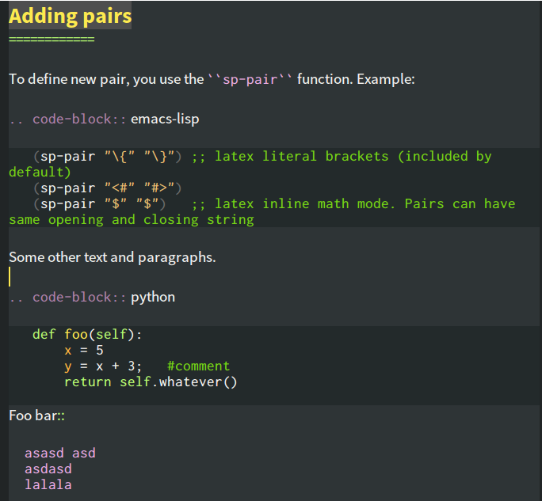

# sphinx-mode

Minor mode providing sphinx support.

# Usage

In your `rst-mode` buffer call `M-x sphinx-mode` to add all the extra features.

# Features

* [x] Add fontification support
* [ ] Add support for insertion of labels
* [x] Add support for insertion of references (`:ref:`) (with a menu of available labels)
* [x] Add support for jumping to a label/reference
* [ ] Add footnote (`[#note]`) support
* [ ] Add reference (`[ref]`) support

## Native code-block fontification

Similar to `org-mode`, we provide native emacs fontification of code blocks,
which can be tweaked by changing `sphinx-code-block-face`.

## Compile and view Sphinx projects

In `rst-mode`, `rst-compile` prompts you to run `rst2html`, but Sphinx projects should be compiled by running `make` in the project directory.

`sphinx-compile` (`C-c C-x C-c`) locates the directory containing the Makefile and runs `make $FORMAT`, prompting you for a `$FORMAT` in the minibuffer (default html).

`sphinx-compile-and-view` (`C-c C-x C-v`) runs `sphinx-compile`, then opens with `xdg-open` the compiled version of the source file being visited by the current buffer.
